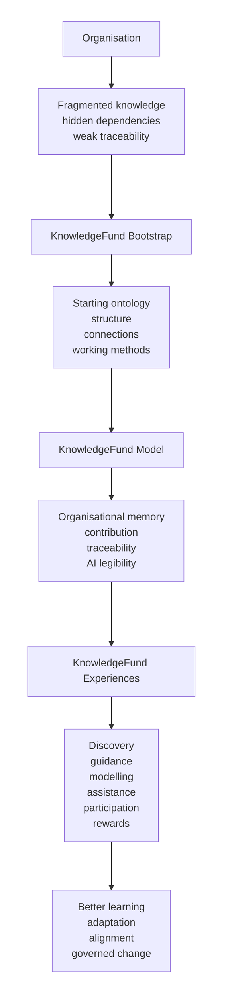

KnowledgeFund needs a simple visual explanation as well as words.

## Table of Contents

## Diagram

## Reading the diagram

The point is not to treat KnowledgeFund as just another software layer.

It begins with the real organisation as it exists today, usually fragmented and unevenly structured. The bootstrap phase helps establish a starting ontology and set of working methods. The model gives that structure coherence. The experiences make it visible and usable in everyday work.

Over time, the result should be a more legible organisation, one that can learn, adapt, and work with AI in ways that help its people rather than simply accelerating noise.

## Core elements

### 1. Organisation
The real company, with its people, systems, history, politics, habits, and goals.

### 2. Bootstrap
The practical starting path for creating a usable initial KnowledgeFund.

### 3. Model
The organising ontology and structural logic that makes knowledge, work, and decisions legible.

### 4. Experiences
The practical surfaces through which people interact with the KnowledgeFund.

### 5. Outcomes
Better organisational memory, clearer contribution, earlier gap detection, stronger alignment, and more useful AI support.
